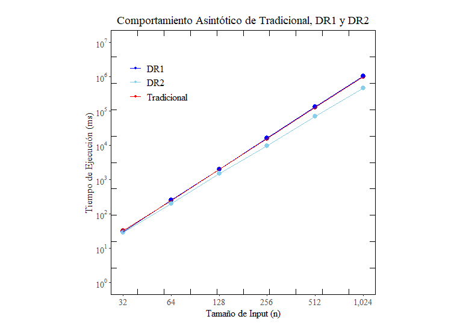

MatrixMultiplier
===
This project aims to compare three different algorithms for matrix multiplication by running them on different sizes of
matrices and comparing their execution times. The three algorithms are:

* Naive (Traditional).
* Divide and conquer.
* Strassen's algorithm.

The project is written in Python and uses the `numpy` library for matrix operations.

## Running
At the top of `main.py`, you will find the following:
```python
MATRIX_SIZE = [32, 64, 128, 256, 512, 1024] # n
```

You may modify the *n* values to change the size of the matrices to be multiplied. The program will generate two random
matrices of size *n* x *n* for each of the values you provide, and then multiply them using the three algorithms
mentioned above. 

To run the program, first install the dependencies:
```bash
pip install -r requirements.txt
```

Then run the main script:
```bash
python main.py
```

The results are saved to a CSV file in the `data/` directory, which are then used to generate graphs with R. If you
want to generate the graphs, simply open `MatrixMultiplier.Rproj` with RStudio and run the script. The generated graphs
will look as follows:



## Dependencies
### Python
- [Python 3.8 or above](https://www.python.org/downloads/)
- Python modules:
  - numpy
- I suggest using venv & pip for development & dependency management. (In case of Apple Silicon use conda)

### R
- [R 4.0 or above](https://cran.r-project.org/)

## Notes
This project was written as part of the Masters in Computer Science course "Advanced Data Structures and Algorithms" at
the University of the Bío-Bío.

Some of the TeX/PDF files are in Spanish, as the course was taught in Spanish, but I've made an effort to translate the
relevant parts to english.
